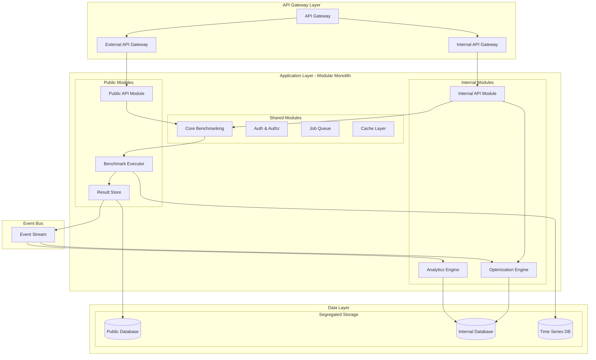

# Research Spike: Dual-Purpose Benchmarking Architecture

**Date:** 2025-11-19
**Author:** Backend Architecture Team
**Epic:** Epic 4 - Benchmark Execution Engine
**Stories:** 4.5, 4.6, 4.7
**Status:** Research Complete

---

## Executive Summary

This research spike evaluates architectural patterns for implementing a benchmarking system that serves both internal Tamma optimization and external Test Platform users. The recommended approach combines a **modular monolith architecture** with **logical multi-tenancy** and **event-driven communication**, providing clear separation of concerns while enabling efficient resource utilization and code reuse.

## Table of Contents

1. [Context & Requirements](#context--requirements)
2. [Architectural Pattern Evaluation](#architectural-pattern-evaluation)
3. [Recommended Architecture](#recommended-architecture)
4. [API Design Patterns](#api-design-patterns)
5. [Data Isolation Strategy](#data-isolation-strategy)
6. [Deployment & Scaling Strategy](#deployment--scaling-strategy)
7. [Configuration Management](#configuration-management)
8. [Code Organization](#code-organization)
9. [Migration Strategy](#migration-strategy)
10. [Implementation Roadmap](#implementation-roadmap)

---

## Context & Requirements

### Business Context

The benchmarking system must serve two distinct but related use cases:

1. **Internal (Tamma)**: Optimize AI agents based on benchmark results, with full access to detailed performance data and optimization algorithms
2. **External (Test Platform)**: Provide benchmarking-as-a-service to users with controlled access and privacy protection

### Key Requirements

- **Data Isolation**: Prevent leakage of Tamma's proprietary optimization data
- **Resource Sharing**: Efficiently utilize infrastructure for both use cases
- **Code Reuse**: Avoid duplication of benchmarking logic
- **Independent Scaling**: Scale internal and external workloads independently
- **Different SLAs**: Support different priority levels and quality guarantees
- **Progressive Rollout**: Deploy features gradually to different audiences

### Technical Constraints

- Must integrate with existing Test Platform infrastructure
- Should support both synchronous (API) and asynchronous (batch) operations
- Need to handle potentially sensitive benchmark configurations
- Requires audit trail for compliance and debugging

---

## Architectural Pattern Evaluation

### 1. Microservices Architecture

**Description**: Separate services for internal and external use cases with shared infrastructure services.

**Pros:**
- Complete isolation between internal and external systems
- Independent deployment and scaling
- Technology diversity possible
- Clear service boundaries

**Cons:**
- High operational complexity
- Network overhead between services
- Data consistency challenges
- Significant code duplication for shared logic
- Higher infrastructure costs

**Verdict:** ❌ **Not Recommended** - Overhead outweighs benefits for this use case

### 2. Traditional Monolith

**Description**: Single application serving both internal and external users with role-based separation.

**Pros:**
- Simple deployment and operations
- Easy code sharing
- Consistent data access
- Lower infrastructure costs

**Cons:**
- No physical isolation between use cases
- Difficult to scale components independently
- Risk of internal logic exposure
- Single point of failure
- Deployment affects all users

**Verdict:** ❌ **Not Recommended** - Insufficient isolation and flexibility

### 3. Modular Monolith (Recommended)

**Description**: Single deployable unit with well-defined module boundaries and logical separation.

**Pros:**
- Clear module boundaries with enforced contracts
- Efficient code sharing through common modules
- Simpler operations than microservices
- Can evolve to microservices if needed
- Good balance of isolation and efficiency

**Cons:**
- Requires disciplined architecture enforcement
- Still deploys as single unit (mitigated by feature flags)
- Shared process space (mitigated by logical isolation)

**Verdict:** ✅ **Recommended** - Best balance for current requirements

### 4. Serverless Functions

**Description**: Individual functions for different operations with shared data layer.

**Pros:**
- Automatic scaling
- Pay-per-use pricing
- Natural isolation between functions
- Easy to deploy updates

**Cons:**
- Cold start latency issues
- Vendor lock-in
- Complex orchestration for workflows
- Limited execution time
- Difficult to maintain state

**Verdict:** ⚠️ **Partial Use** - Good for specific async operations

---

## Recommended Architecture

### High-Level Architecture



### Component Descriptions

#### 1. API Gateway Layer
- **Routing**: Separate paths for internal (`/internal/*`) and external (`/api/*`) endpoints
- **Rate Limiting**: Different limits for internal (higher) vs external (configurable by tier)
- **Authentication**: OAuth/JWT for external, mTLS for internal services
- **Request Transformation**: Version adaptation and payload validation

#### 2. Application Modules

**Public Modules:**
- **Public API**: RESTful and GraphQL endpoints for external users
- **Benchmark Executor**: Core execution engine (shared)
- **Result Store**: Manages benchmark results with privacy filtering

**Internal Modules:**
- **Internal API**: Extended API with full data access
- **Optimization Engine**: Tamma-specific optimization algorithms
- **Analytics Engine**: Deep performance analysis and insights

**Shared Modules:**
- **Core Benchmarking**: Reusable benchmark logic
- **Auth & Authz**: Unified authentication and authorization
- **Job Queue**: Asynchronous job processing
- **Cache Layer**: Performance optimization

#### 3. Event-Driven Communication
- **Event Types**: BenchmarkCompleted, OptimizationTriggered, ResultsPublished
- **Pub/Sub Pattern**: Loose coupling between modules
- **Event Sourcing**: Audit trail and replay capability

#### 4. Data Segregation
- **Public Database**: Anonymized benchmark results
- **Internal Database**: Full optimization data and configurations
- **Time Series DB**: Performance metrics for both use cases

---

## API Design Patterns

### 1. Versioned APIs

```typescript
// External API - Limited data exposure
interface ExternalBenchmarkResult {
  id: string;
  benchmarkId: string;
  provider: string;
  model: string;
  score: number;
  metrics: PublicMetrics;
  timestamp: Date;
}

// Internal API - Full data access
interface InternalBenchmarkResult extends ExternalBenchmarkResult {
  optimizationData: OptimizationData;
  costAnalysis: CostBreakdown;
  internalMetrics: DetailedMetrics;
  agentConfiguration: AgentConfig;
}
```

### 2. Gateway Pattern Implementation

```typescript
// API Gateway configuration
const gatewayConfig = {
  routes: [
    {
      path: '/api/v1/*',
      target: 'public-api-module',
      rateLimit: { tier: 'public', requests: 100, window: '1m' },
      authentication: 'jwt',
      transformResponse: 'filterSensitiveData'
    },
    {
      path: '/internal/v1/*',
      target: 'internal-api-module',
      rateLimit: { tier: 'internal', requests: 1000, window: '1m' },
      authentication: 'mtls',
      transformResponse: 'none'
    }
  ]
};
```

### 3. Resource-Based Design

```typescript
// Public API endpoints
GET    /api/v1/benchmarks                 // List public benchmarks
POST   /api/v1/benchmarks                 // Create benchmark run
GET    /api/v1/benchmarks/:id             // Get benchmark details
GET    /api/v1/benchmarks/:id/results     // Get results (filtered)

// Internal API endpoints
GET    /internal/v1/benchmarks            // All benchmarks with full data
POST   /internal/v1/optimizations         // Trigger optimization
GET    /internal/v1/agent-configs         // Agent configurations
PUT    /internal/v1/agent-configs/:id     // Update configuration
GET    /internal/v1/analytics/insights    // Deep analytics
```

### 4. GraphQL Schema Separation

```graphql
# Public schema
type PublicBenchmark {
  id: ID!
  name: String!
  results: [PublicResult!]!
  averageScore: Float!
  completedAt: DateTime!
}

# Internal schema (extends public)
type InternalBenchmark {
  id: ID!
  name: String!
  results: [InternalResult!]!
  averageScore: Float!
  completedAt: DateTime!
  optimizationSuggestions: [Optimization!]!
  costAnalysis: CostBreakdown!
  agentPerformance: AgentMetrics!
}
```

---

## Data Isolation Strategy

### 1. Logical Multi-Tenancy

```typescript
// Tenant context injection
interface TenantContext {
  tenantId: string;
  tenantType: 'internal' | 'external';
  permissions: Permission[];
  dataAccessLevel: DataAccessLevel;
}

// Repository pattern with tenant awareness
class BenchmarkRepository {
  async findAll(context: TenantContext): Promise<Benchmark[]> {
    const query = this.baseQuery();

    if (context.tenantType === 'external') {
      query.where('is_public', true)
           .select(this.publicFields);
    } else {
      query.select('*'); // Full access for internal
    }

    return query.execute();
  }
}
```

### 2. Data Classification

```typescript
enum DataClassification {
  PUBLIC = 'public',           // Can be shared externally
  INTERNAL = 'internal',       // Tamma use only
  SENSITIVE = 'sensitive',     // Requires encryption
  RESTRICTED = 'restricted'    // Special access only
}

interface DataRecord {
  id: string;
  classification: DataClassification;
  data: any;
  accessControl: AccessControl;
}
```

### 3. Encryption Strategy

```typescript
// Field-level encryption for sensitive data
class EncryptionService {
  encryptField(value: any, classification: DataClassification): string {
    if (classification >= DataClassification.SENSITIVE) {
      return this.encrypt(value, this.getKeyForClassification(classification));
    }
    return value;
  }

  decryptField(value: string, classification: DataClassification, context: TenantContext): any {
    if (!this.hasAccess(context, classification)) {
      throw new UnauthorizedError();
    }
    return this.decrypt(value, this.getKeyForClassification(classification));
  }
}
```

### 4. Audit Trail

```typescript
interface AuditEntry {
  id: string;
  timestamp: Date;
  tenantId: string;
  userId: string;
  action: string;
  resource: string;
  dataClassification: DataClassification;
  details: Record<string, any>;
  ipAddress: string;
  userAgent: string;
}

class AuditService {
  async log(entry: AuditEntry): Promise<void> {
    // Immutable audit log
    await this.auditDb.insert(entry);

    // Real-time alerting for sensitive operations
    if (entry.dataClassification >= DataClassification.SENSITIVE) {
      await this.alertService.notify(entry);
    }
  }
}
```

---

## Deployment & Scaling Strategy

### 1. Container-Based Deployment

```yaml
# Docker Compose for local development
version: '3.8'
services:
  app:
    build: .
    environment:
      - MODULE_ISOLATION=enabled
      - TENANT_MODE=multi
    ports:
      - "3000:3000"  # Public API
      - "3001:3001"  # Internal API
    deploy:
      replicas: 3
      resources:
        limits:
          cpus: '2'
          memory: 4G

  job-worker:
    build: .
    command: npm run worker
    environment:
      - WORKER_TYPE=benchmark
      - PRIORITY_QUEUES=internal,external
    deploy:
      replicas: 5

  internal-worker:
    build: .
    command: npm run internal-worker
    environment:
      - WORKER_TYPE=optimization
      - ACCESS_LEVEL=internal
    deploy:
      replicas: 2
```

### 2. Kubernetes Deployment Architecture

```yaml
# Horizontal Pod Autoscaling configuration
apiVersion: autoscaling/v2
kind: HorizontalPodAutoscaler
metadata:
  name: benchmark-api-hpa
spec:
  scaleTargetRef:
    apiVersion: apps/v1
    kind: Deployment
    name: benchmark-api
  minReplicas: 3
  maxReplicas: 20
  metrics:
  - type: Resource
    resource:
      name: cpu
      target:
        type: Utilization
        averageUtilization: 70
  - type: Resource
    resource:
      name: memory
      target:
        type: Utilization
        averageUtilization: 80
  behavior:
    scaleUp:
      policies:
      - type: Percent
        value: 100
        periodSeconds: 60
    scaleDown:
      policies:
      - type: Percent
        value: 50
        periodSeconds: 300
```

### 3. Priority-Based Resource Allocation

```typescript
// Queue priority configuration
interface QueueConfig {
  name: string;
  priority: number;
  concurrency: number;
  rateLimit?: RateLimit;
}

const queueConfigurations: QueueConfig[] = [
  {
    name: 'internal-optimization',
    priority: 100,  // Highest priority
    concurrency: 10,
    rateLimit: null  // No rate limit
  },
  {
    name: 'external-premium',
    priority: 50,
    concurrency: 5,
    rateLimit: { requests: 100, window: '1m' }
  },
  {
    name: 'external-free',
    priority: 10,
    concurrency: 2,
    rateLimit: { requests: 10, window: '1m' }
  }
];
```

### 4. Blue-Green Deployment Strategy

```bash
#!/bin/bash
# Blue-green deployment script

# Deploy to green environment
kubectl apply -f k8s/green-deployment.yaml

# Wait for green to be ready
kubectl wait --for=condition=ready pod -l version=green --timeout=300s

# Run smoke tests
npm run test:smoke -- --env=green

if [ $? -eq 0 ]; then
  # Switch traffic to green
  kubectl patch service benchmark-api -p '{"spec":{"selector":{"version":"green"}}}'

  # Wait and monitor
  sleep 60

  # If stable, remove blue
  kubectl delete deployment benchmark-api-blue
else
  # Rollback
  kubectl delete deployment benchmark-api-green
  echo "Deployment failed, staying on blue"
fi
```

---

## Configuration Management

### 1. Feature Flag System

```typescript
// Feature flag configuration
interface FeatureFlag {
  name: string;
  enabled: boolean;
  rolloutPercentage?: number;
  enabledForTenants?: string[];
  enabledForUsers?: string[];
  metadata?: Record<string, any>;
}

class FeatureFlagService {
  private flags: Map<string, FeatureFlag> = new Map();

  isEnabled(flagName: string, context: RequestContext): boolean {
    const flag = this.flags.get(flagName);
    if (!flag) return false;

    // Check if globally enabled
    if (flag.enabled && !flag.rolloutPercentage) return true;

    // Check tenant-specific enablement
    if (flag.enabledForTenants?.includes(context.tenantId)) return true;

    // Check user-specific enablement
    if (flag.enabledForUsers?.includes(context.userId)) return true;

    // Check percentage rollout
    if (flag.rolloutPercentage) {
      const hash = this.hashUserId(context.userId);
      return (hash % 100) < flag.rolloutPercentage;
    }

    return false;
  }
}
```

### 2. Environment-Specific Configuration

```typescript
// Configuration schema
interface AppConfig {
  environment: 'development' | 'staging' | 'production';
  modules: {
    public: ModuleConfig;
    internal: ModuleConfig;
    shared: ModuleConfig;
  };
  database: {
    public: DatabaseConfig;
    internal: DatabaseConfig;
    timeseries: DatabaseConfig;
  };
  redis: RedisConfig;
  queues: QueueConfig[];
  features: FeatureFlag[];
}

// Environment-specific configs
const configs: Record<string, AppConfig> = {
  development: {
    environment: 'development',
    modules: {
      public: { enabled: true, debugMode: true },
      internal: { enabled: true, debugMode: true },
      shared: { enabled: true, debugMode: true }
    },
    // ... rest of config
  },
  production: {
    environment: 'production',
    modules: {
      public: { enabled: true, debugMode: false },
      internal: { enabled: true, debugMode: false },
      shared: { enabled: true, debugMode: false }
    },
    // ... rest of config
  }
};
```

### 3. Dynamic Configuration Updates

```typescript
// Configuration watcher for runtime updates
class ConfigurationManager {
  private watchers: Map<string, ConfigWatcher> = new Map();

  async watchConfig(configKey: string, callback: (config: any) => void) {
    const watcher = new ConfigWatcher(configKey);

    watcher.on('change', async (newConfig) => {
      // Validate configuration
      if (await this.validateConfig(newConfig)) {
        // Apply configuration
        await callback(newConfig);

        // Log configuration change
        await this.auditLog.record({
          action: 'CONFIG_CHANGE',
          configKey,
          timestamp: new Date()
        });
      }
    });

    this.watchers.set(configKey, watcher);
    watcher.start();
  }
}
```

---

## Code Organization

### 1. Module Structure

```
apps/test-platform/
├── src/
│   ├── modules/
│   │   ├── public/                 # External-facing modules
│   │   │   ├── api/
│   │   │   │   ├── controllers/
│   │   │   │   ├── validators/
│   │   │   │   └── transformers/
│   │   │   ├── benchmarks/
│   │   │   │   ├── executor.ts
│   │   │   │   ├── scheduler.ts
│   │   │   │   └── results.ts
│   │   │   └── dashboard/
│   │   │       ├── components/
│   │   │       └── views/
│   │   │
│   │   ├── internal/                # Internal-only modules
│   │   │   ├── api/
│   │   │   │   ├── controllers/
│   │   │   │   └── services/
│   │   │   ├── optimization/
│   │   │   │   ├── engine.ts
│   │   │   │   ├── algorithms/
│   │   │   │   └── recommendations.ts
│   │   │   └── analytics/
│   │   │       ├── insights.ts
│   │   │       └── predictions.ts
│   │   │
│   │   └── shared/                  # Shared modules
│   │       ├── core/
│   │       │   ├── benchmarking.ts
│   │       │   ├── scoring.ts
│   │       │   └── providers.ts
│   │       ├── auth/
│   │       │   ├── authentication.ts
│   │       │   ├── authorization.ts
│   │       │   └── tenant.ts
│   │       ├── data/
│   │       │   ├── repositories/
│   │       │   ├── models/
│   │       │   └── migrations/
│   │       └── infrastructure/
│   │           ├── cache.ts
│   │           ├── queue.ts
│   │           └── events.ts
│   │
│   ├── contracts/                   # Module interfaces/contracts
│   │   ├── public.ts
│   │   ├── internal.ts
│   │   └── shared.ts
│   │
│   └── bootstrap/                   # Application initialization
│       ├── app.ts
│       ├── modules.ts
│       └── dependencies.ts
```

### 2. Module Boundaries and Contracts

```typescript
// Module contract definition
interface ModuleContract {
  name: string;
  version: string;
  dependencies: string[];
  exports: ModuleExports;
  permissions: ModulePermissions;
}

// Public module contract
const publicModuleContract: ModuleContract = {
  name: 'public-api',
  version: '1.0.0',
  dependencies: ['shared-core', 'shared-auth'],
  exports: {
    services: ['BenchmarkService', 'ResultService'],
    events: ['BenchmarkCompleted', 'ResultPublished']
  },
  permissions: {
    dataAccess: ['public', 'anonymized'],
    operations: ['read', 'create-benchmark', 'view-results']
  }
};

// Internal module contract
const internalModuleContract: ModuleContract = {
  name: 'internal-api',
  version: '1.0.0',
  dependencies: ['shared-core', 'shared-auth', 'optimization'],
  exports: {
    services: ['OptimizationService', 'AnalyticsService'],
    events: ['OptimizationTriggered', 'InsightGenerated']
  },
  permissions: {
    dataAccess: ['all'],
    operations: ['all']
  }
};
```

### 3. Dependency Injection Container

```typescript
// IoC container setup
import { Container } from 'inversify';

class ModularContainer {
  private container: Container;
  private modules: Map<string, Module> = new Map();

  constructor() {
    this.container = new Container();
    this.setupSharedBindings();
  }

  registerModule(module: Module, context: ModuleContext) {
    // Validate module contract
    this.validateContract(module.contract);

    // Check dependencies
    this.checkDependencies(module.contract.dependencies);

    // Register module services
    module.services.forEach(service => {
      this.container.bind(service.token)
        .to(service.implementation)
        .when(request => this.checkPermissions(request, module.contract));
    });

    this.modules.set(module.contract.name, module);
  }

  private checkPermissions(request: any, contract: ModuleContract): boolean {
    const context = request.context;
    // Implement permission checking based on module contract
    return true;
  }
}
```

### 4. Event-Driven Module Communication

```typescript
// Event bus for module communication
interface ModuleEvent {
  id: string;
  source: string;
  type: string;
  timestamp: Date;
  data: any;
  metadata: EventMetadata;
}

class ModuleEventBus {
  private subscribers: Map<string, Set<EventHandler>> = new Map();

  publish(event: ModuleEvent): void {
    // Validate event source permissions
    if (!this.validateEventSource(event)) {
      throw new UnauthorizedEventError();
    }

    // Get subscribers for event type
    const handlers = this.subscribers.get(event.type) || new Set();

    // Process event asynchronously
    handlers.forEach(handler => {
      setImmediate(() => {
        try {
          handler(event);
        } catch (error) {
          this.handleError(event, error);
        }
      });
    });

    // Persist event for audit
    this.persistEvent(event);
  }

  subscribe(eventType: string, handler: EventHandler, module: string): void {
    // Validate module can subscribe to this event type
    if (!this.canSubscribe(module, eventType)) {
      throw new UnauthorizedSubscriptionError();
    }

    if (!this.subscribers.has(eventType)) {
      this.subscribers.set(eventType, new Set());
    }

    this.subscribers.get(eventType)!.add(handler);
  }
}
```

---

## Migration Strategy

### Phase 1: Foundation (Weeks 1-2)

```typescript
// 1. Setup module structure
const migrationPhase1 = {
  tasks: [
    'Create module directory structure',
    'Define module contracts and interfaces',
    'Setup dependency injection container',
    'Implement event bus for module communication',
    'Create shared core module with existing logic'
  ],
  deliverables: [
    'Module architecture documented',
    'Shared core module operational',
    'Event bus functional',
    'Basic module isolation working'
  ]
};
```

### Phase 2: API Separation (Weeks 3-4)

```typescript
// 2. Implement dual API structure
const migrationPhase2 = {
  tasks: [
    'Create public API module',
    'Create internal API module',
    'Implement API gateway routing',
    'Setup authentication for each API',
    'Add rate limiting and throttling'
  ],
  deliverables: [
    'Public API endpoints functional',
    'Internal API with extended capabilities',
    'API gateway routing traffic correctly',
    'Authentication working for both APIs'
  ]
};
```

### Phase 3: Data Isolation (Weeks 5-6)

```typescript
// 3. Implement data segregation
const migrationPhase3 = {
  tasks: [
    'Setup logical multi-tenancy',
    'Implement data classification system',
    'Create privacy filters for public data',
    'Add field-level encryption for sensitive data',
    'Implement audit trail system'
  ],
  deliverables: [
    'Data properly isolated between contexts',
    'Privacy filters working',
    'Audit trail capturing all operations',
    'Encryption applied to sensitive fields'
  ]
};
```

### Phase 4: Optimization Module (Weeks 7-8)

```typescript
// 4. Build internal optimization capabilities
const migrationPhase4 = {
  tasks: [
    'Create optimization engine module',
    'Implement Tamma-specific algorithms',
    'Build recommendation system',
    'Add performance prediction models',
    'Create feedback loop for improvements'
  ],
  deliverables: [
    'Optimization engine operational',
    'Recommendations generated from benchmarks',
    'Performance predictions accurate',
    'Feedback loop improving suggestions'
  ]
};
```

### Phase 5: Intelligence Engine (Weeks 9-10)

```typescript
// 5. Implement cross-platform intelligence
const migrationPhase5 = {
  tasks: [
    'Create data aggregation pipelines',
    'Implement pattern recognition',
    'Build knowledge base system',
    'Add real-time insight generation',
    'Create competitive intelligence features'
  ],
  deliverables: [
    'Aggregated insights available',
    'Pattern recognition identifying trends',
    'Knowledge base accessible',
    'Real-time insights updating'
  ]
};
```

### Phase 6: User Dashboard (Weeks 11-12)

```typescript
// 6. Build user-facing dashboard
const migrationPhase6 = {
  tasks: [
    'Create dashboard UI components',
    'Implement real-time updates',
    'Add custom benchmark creation',
    'Build comparative analysis tools',
    'Create export and sharing features'
  ],
  deliverables: [
    'Dashboard fully functional',
    'Real-time updates working',
    'Users can create custom benchmarks',
    'Comparative analysis available',
    'Export functionality operational'
  ]
};
```

### Rollback Strategy

```typescript
// Rollback plan for each phase
interface RollbackPlan {
  phase: number;
  trigger: string;
  actions: string[];
  fallback: string;
}

const rollbackPlans: RollbackPlan[] = [
  {
    phase: 1,
    trigger: 'Module isolation failing',
    actions: [
      'Revert to monolithic structure',
      'Keep shared core improvements',
      'Document lessons learned'
    ],
    fallback: 'Continue with traditional monolith'
  },
  {
    phase: 2,
    trigger: 'API gateway causing performance issues',
    actions: [
      'Remove gateway layer',
      'Direct routing to modules',
      'Implement rate limiting in application'
    ],
    fallback: 'Single API with role-based access'
  }
  // ... additional rollback plans
];
```

---

## Implementation Roadmap

### Milestone 1: Foundation (Month 1)

- ✅ Module architecture implementation
- ✅ Shared core module extraction
- ✅ Event bus setup
- ✅ Basic API separation
- ✅ Development environment setup

### Milestone 2: Isolation & Security (Month 2)

- 🔄 Multi-tenancy implementation
- 🔄 Data classification system
- 🔄 Privacy filters
- 🔄 Audit trail
- 🔄 Security testing

### Milestone 3: Internal Features (Month 3)

- 📅 Optimization engine
- 📅 Analytics system
- 📅 Tamma integration
- 📅 Performance tracking
- 📅 A/B testing framework

### Milestone 4: External Features (Month 4)

- 📅 Public API completion
- 📅 User dashboard
- 📅 Custom benchmarks
- 📅 Export capabilities
- 📅 Documentation

### Milestone 5: Intelligence & Scale (Month 5)

- 📅 Cross-platform intelligence
- 📅 Pattern recognition
- 📅 Knowledge base
- 📅 Scaling optimization
- 📅 Performance tuning

### Milestone 6: Production Ready (Month 6)

- 📅 Load testing
- 📅 Security audit
- 📅 Documentation completion
- 📅 Deployment automation
- 📅 Monitoring setup

---

## Risk Assessment

### Technical Risks

| Risk | Impact | Probability | Mitigation |
|------|--------|-------------|------------|
| Module boundaries violated | High | Medium | Automated architecture tests, code reviews |
| Data leakage between contexts | Critical | Low | Encryption, audit trails, security testing |
| Performance degradation | Medium | Medium | Caching, optimization, horizontal scaling |
| Complex deployment | Medium | High | CI/CD automation, blue-green deployments |
| Feature flag complexity | Low | High | Centralized management, gradual rollout |

### Operational Risks

| Risk | Impact | Probability | Mitigation |
|------|--------|-------------|------------|
| Increased operational overhead | Medium | High | Monitoring, alerting, runbooks |
| Deployment failures | High | Medium | Rollback procedures, canary deployments |
| Configuration drift | Medium | Medium | GitOps, configuration validation |
| Team knowledge gaps | Medium | High | Documentation, training, pair programming |

---

## Success Criteria

### Technical Metrics

- **Isolation**: Zero data leakage incidents between contexts
- **Performance**: <100ms API response time (p95)
- **Availability**: 99.9% uptime for public API
- **Scalability**: Support 1000+ concurrent benchmarks
- **Code Reuse**: >70% shared code between contexts

### Business Metrics

- **Internal Efficiency**: 50% reduction in optimization time
- **User Satisfaction**: >4.5/5 dashboard rating
- **API Adoption**: 100+ API consumers within 6 months
- **Cost Optimization**: 30% reduction in benchmark costs
- **Intelligence Value**: 10+ insights generated daily

### Quality Metrics

- **Test Coverage**: >90% for critical paths
- **Security**: Pass external security audit
- **Documentation**: 100% API documentation coverage
- **Monitoring**: <5 minute incident detection time
- **Deployment**: <30 minute deployment time

---

## Conclusion

The recommended **modular monolith with logical multi-tenancy** architecture provides the optimal balance of:

1. **Isolation**: Clear boundaries between internal and external use cases
2. **Efficiency**: Shared code and infrastructure reduce duplication
3. **Flexibility**: Can evolve to microservices if needed
4. **Simplicity**: Easier to operate than full microservices
5. **Security**: Multiple layers of data protection and access control

This architecture enables Tamma to leverage benchmark data for internal optimization while providing valuable benchmarking services to external users, all while maintaining data privacy, enabling independent scaling, and supporting progressive feature rollout.

### Next Steps

1. **Review and approve** architectural design with stakeholders
2. **Create proof of concept** for module isolation and API separation
3. **Develop detailed implementation plan** for Phase 1
4. **Set up development environment** with module structure
5. **Begin Phase 1 implementation** with foundation components

### References

- Story 4.5: Agent Customization Benchmarking Suite
- Story 4.6: Cross-Platform Intelligence Engine
- Story 4.7: User Benchmarking Dashboard
- Epic 4: Benchmark Execution Engine Technical Specification
- Test Platform Architecture Document
- Domain-Driven Design principles
- Microservices vs Modular Monolith patterns
- Multi-tenancy architectural patterns