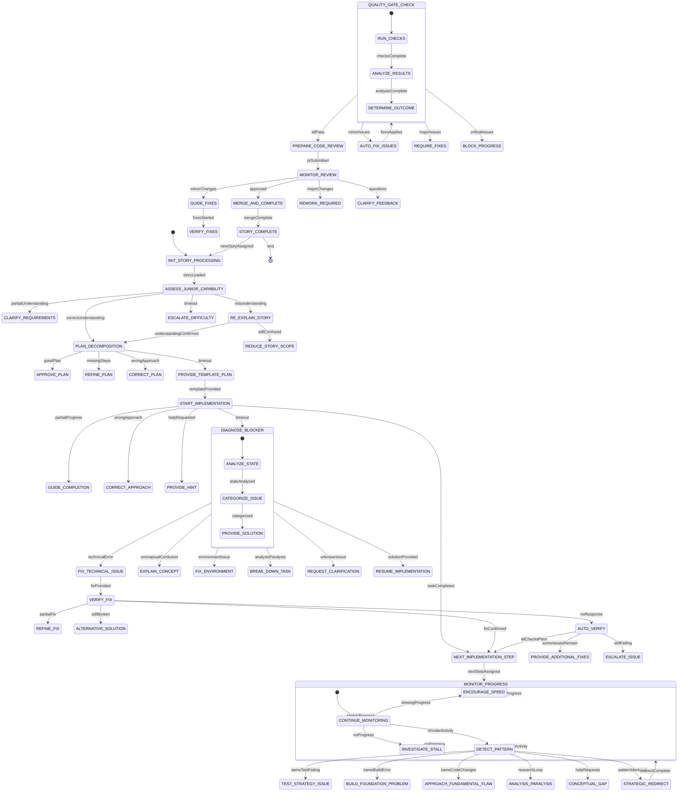

# Autonomous Junior Developer Mentorship State Machine - UML Diagram

## State Descriptions

### Initial States

- **INIT_STORY_PROCESSING**: Load and analyze the assigned story
- **ASSESS_JUNIOR_CAPABILITY**: Evaluate junior's understanding of requirements
- **RE_EXPLAIN_STORY**: Provide simpler explanation when misunderstood

### Planning States

- **PLAN_DECOMPOSITION**: Request and analyze implementation plan
- **PROVIDE_TEMPLATE_PLAN**: Give structured template when needed

### Implementation States

- **START_IMPLEMENTATION**: Begin with specific first task
- **NEXT_IMPLEMENTATION_STEP**: Determine next logical step
- **MONITOR_PROGRESS**: Monitor activity and progress patterns

### Problem Resolution States

- **DIAGNOSE_BLOCKER**: Analyze why junior is stuck
- **FIX_TECHNICAL_ISSUE**: Provide specific technical fixes
- **VERIFY_FIX**: Confirm fix effectiveness
- **AUTO_VERIFY**: Automatically verify when no response
- **DETECT_PATTERN**: Identify and break circular patterns
- **STRATEGIC_REDIRECT**: Change approach when needed

### Quality Assurance States

- **QUALITY_GATE_CHECK**: Run comprehensive quality checks
- **AUTO_FIX_ISSUES**: Automatically fix minor issues

### Review States

- **PREPARE_CODE_REVIEW**: Create and submit pull request
- **MONITOR_REVIEW**: Track review progress and feedback
- **GUIDE_FIXES**: Help implement review feedback

### Completion States

- **MERGE_AND_COMPLETE**: Final merge and completion
- **STORY_COMPLETE**: Story successfully completed

## Key Features

### Timeout Handling

- Simple tasks: 15 minutes → DIAGNOSE_BLOCKER
- Complex tasks: 30 minutes → PROVIDE_HINT
- Research tasks: 45 minutes → GIVE_ANSWER
- Stuck > 1 hour → ESCALATE_TO_HUMAN
- No progress > 2 hours → STORY_TIMEOUT

### Quality Gates

- Test coverage ≥ 90%
- No linting errors
- No type errors
- Build must succeed
- Security scan clean

### Monitoring Metrics

- Response time tracking
- Task completion time
- Error rate monitoring
- Help request counting
- Skill progress assessment

### Escalation Triggers

- 3+ timeouts on same task
- Same error repeated 5+ times
- No progress for 2+ hours
- Junior expresses frustration
- System cannot diagnose issue

## Transition Conditions

### Success Paths

- ✅ Correct understanding → Plan decomposition
- ✅ Good plan → Implementation start
- ✅ Task completed → Next step
- ✅ All quality gates pass → Code review
- ✅ Review approved → Merge and complete

### Problem Paths

- ⚠️ Partial understanding → Clarification
- ⚠️ Missing steps → Plan refinement
- ⚠️ Wrong approach → Correction
- ⚠️ Timeout → Blocker diagnosis
- ⚠️ Minor issues → Auto-fix

### Failure Paths

- ❌ Misunderstanding → Re-explanation
- ❌ Major issues → Require fixes
- ❌ Critical issues → Block progress
- ❌ Multiple failures → Escalation

## Adaptive Features

### Learning Pattern Recognition

- Common mistakes → Targeted training
- Quick learning → Increase complexity
- Repeated issues → Pattern detection
- Fast progress → Reduce guidance
- Slow progress → Increase support

### Dynamic Timeout Adjustment

- Based on task complexity
- Junior's historical performance
- Current difficulty level
- Time of day considerations
- System load factors

### Personalized Guidance

- Adapts to junior's learning style
- Considers past successes/failures
- Adjusts communication approach
- Provides relevant examples
- Offers appropriate challenge level
